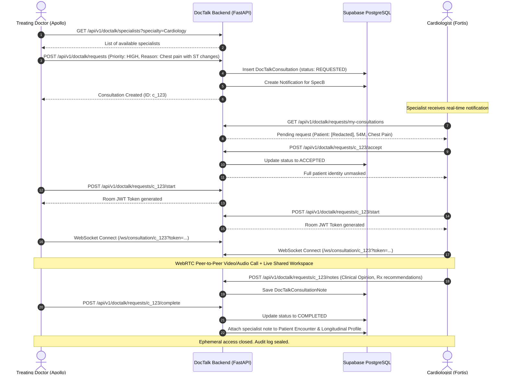
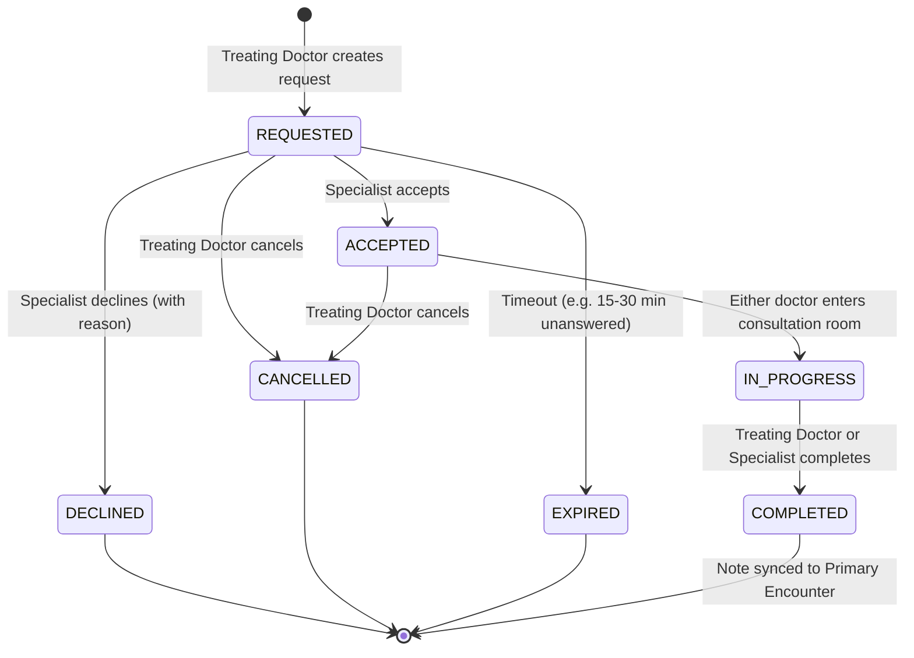

# DocTalk — Cross-Hospital Specialist Consultation System
### Architectural Specification, Workflow & Integration Guide

---

## 1. Overview & Problem Statement

In high-volume Indian hospital networks (e.g., Apollo, Fortis, Max), general physicians and duty medical officers in Outpatient Departments (OPD) frequently encounter complex cases requiring immediate specialist input (e.g., Cardiology, Neurology, Nephrology, Oncology). 

Traditionally, this requires either:
1. Referring the patient to another department/hospital with days of delay.
2. Informal, non-compliant communication (WhatsApp/phone calls) that leaks unprotected patient health information (PHI) and leaves **no medico-legal audit trail**.

**DocTalk** is MediPlatform's secure, zero-trust, cross-hospital tele-consultation platform built specifically for physician-to-physician collaboration. It allows a treating physician to discover available specialists across network hospitals, request a real-time consultation with ephemeral clinical context, conduct an encrypted WebRTC audio/video call with collaborative note-taking, and formally attach signed specialist recommendations to the patient's primary electronic health record.

---

## 2. Core Architectural Pillars

```
┌─────────────────────────────────────────────────────────────────────────────┐
│                             DOCTALK PILLARS                                 │
├───────────────────┬───────────────────┬──────────────────┬──────────────────┤
│   ZERO-TRUST      │   PRE-ACCEPTANCE  │    EPHEMERAL     │   COLLABORATIVE  │
│  CROSS-TENANT     │   PRIVACY GUARD   │  CLINICAL CONTEXT│    ENCOUNTER     │
│   SECURITY        │ (DE-IDENTIFICATION│  (TIME-BOUNDED)  │   INTEGRATION    │
└───────────────────┴───────────────────┴──────────────────┴──────────────────┘
```

### A. Zero-Trust Cross-Tenant Security
Unlike standard hospital endpoints that restrict data access to a single hospital tenant, DocTalk allows authenticated doctors from Hospital A to collaborate with specialists from Hospital B under strict, cryptographically verified boundaries:
* All DocTalk routes are protected by `require_authenticated_doctor`.
* Session room tokens are signed JWTs containing `consultation_id`, `doctor_id`, `role`, and an expiration time.
* Third parties or unauthorized doctors attempting to access consultation context receive `403 Forbidden` or `404 Not Found`.

### B. Pre-Acceptance Privacy Guard (Anonymization)
Before a specialist explicitly accepts a consultation request:
* The patient’s **name, phone number, address, and government IDs are completely redacted**.
* The specialist only sees age, gender, priority, reason for consultation, and relevant anonymized clinical questions.
* Full longitudinal identity is only unmasked **after** the specialist clicks **Accept Consultation**.

### C. Time-Bounded Ephemeral Context Access
Specialists from external hospitals are not granted permanent access to the patient’s longitudinal record:
* Access is mediated by `DocTalkContextService`.
* Context is accessible **strictly while the consultation is in `ACCEPTED` or `IN_PROGRESS` status**.
* Once the consultation is marked `COMPLETED` or `CANCELLED`, the ephemeral access window closes immediately.

### D. Real-Time WebRTC & WebSocket Relay
* **Peer-to-Peer Media**: High-definition, low-latency audio/video communication via WebRTC.
* **WebSocket Signaling**: FastAPI-powered WebSocket relay (`/api/v1/doctalk/ws/consultation/{id}`) handles SDP offers, answers, ICE candidates, and live collaborative note typing.
* **Message Size Guard**: Maximum 64 KB per message to prevent memory exhaustion attacks.

### E. Medico-Legal Audit Trail
Every single action in DocTalk is immutably logged in the `audit_logs` table:
* Who requested the consultation and when.
* When the specialist viewed the context.
* When the consultation was accepted, started, and completed.
* The exact specialist note and recommendations signed off.

---

## 3. End-to-End Workflow & Lifecycle



---

## 4. State Machine & Status Lifecycle

A consultation transitions through the following finite states:



| State | Description | Patient Identity Visible? | Clinical Context Accessible? | Room Open? |
|---|---|:---:|:---:|:---:|
| `REQUESTED` | Request pending specialist response | ❌ (Age & Gender only) | ❌ | ❌ |
| `ACCEPTED` | Specialist accepted, awaiting meeting | ✅ | ✅ | ❌ |
| `IN_PROGRESS` | Active video call & workspace | ✅ | ✅ | ✅ |
| `COMPLETED` | Finished; note saved to medical record | ✅ (in final record) | ❌ (session closed) | ❌ |
| `DECLINED` | Specialist rejected with reason | ❌ | ❌ | ❌ |
| `CANCELLED` | Cancelled by requesting doctor | ❌ | ❌ | ❌ |
| `EXPIRED` | Timed out without answer | ❌ | ❌ | ❌ |

---

## 5. Database Schema

DocTalk relies on three core PostgreSQL tables defined in [`backend/app/models/models.py`](file:///d:/PROJECTSSSSS/MediKiosk/backend/app/models/models.py):

### 1. `doctalk_consultations`
Tracks the primary consultation contract between two physicians across hospitals:
* `id` (`UUID`, PK): Unique consultation ID.
* `encounter_id` (`UUID`, FK `encounters.id`): Originating encounter.
* `patient_id` (`UUID`, FK `patients.id`): Patient being discussed.
* `requesting_doctor_id` (`UUID`, FK `users.id`): Doctor requesting the consult.
* `requesting_hospital_id` (`UUID`, FK `hospitals.id`): Originating hospital.
* `specialist_id` (`UUID`, FK `users.id`, nullable): Assigned specialist.
* `specialist_hospital_id` (`UUID`, FK `hospitals.id`, nullable): Specialist's hospital.
* `specialty_requested` (`VARCHAR`): e.g., "Cardiology", "Neurology".
* `priority` (`VARCHAR`): `ROUTINE`, `URGENT`, `EMERGENCY`.
* `status` (`VARCHAR`): `REQUESTED`, `ACCEPTED`, `DECLINED`, `CANCELLED`, `IN_PROGRESS`, `COMPLETED`, `EXPIRED`.
* `clinical_question` (`TEXT`): Specific diagnostic or therapeutic query.
* `provisional_diagnosis` (`TEXT`): Working diagnosis from treating doctor.
* `requested_duration_minutes` (`INTEGER`): 5, 10, 15, or 30 minutes.
* `decline_reason` (`TEXT`, nullable): Reason provided if declined.
* `created_at`, `accepted_at`, `started_at`, `completed_at` (`TIMESTAMP WITH TIME ZONE`).

### 2. `doctalk_consultation_notes`
The formal clinical opinion authored by the specialist:
* `id` (`UUID`, PK): Unique note ID.
* `consultation_id` (`UUID`, FK `doctalk_consultations.id`): Parent consultation.
* `encounter_id` (`UUID`, FK `encounters.id`): Linked encounter.
* `specialist_id` (`UUID`, FK `users.id`): Authoring specialist.
* `specialist_hospital_id` (`UUID`, FK `hospitals.id`): Author's hospital.
* `clinical_opinion` (`TEXT`): Specialist's diagnostic impression.
* `recommendations` (`JSONB`): Structured medication changes, lifestyle advice, or dosage adjustments.
* `further_evaluation` (`JSONB`): Recommended investigations (ECG, Trop-I, MRI, etc.).
* `follow_up` (`TEXT`): When and how the patient should follow up.
* `created_at`, `updated_at` (`TIMESTAMP WITH TIME ZONE`).

### 3. `doctalk_notifications`
In-app real-time notification queue for doctors:
* `id` (`UUID`, PK).
* `user_id` (`UUID`, FK `users.id`): Recipient doctor.
* `consultation_id` (`UUID`, FK `doctalk_consultations.id`).
* `type` (`VARCHAR`): `REQUEST_RECEIVED`, `REQUEST_ACCEPTED`, `REQUEST_DECLINED`, `CONSULTATION_STARTED`, `NOTE_ADDED`.
* `title` (`VARCHAR`), `message` (`TEXT`).
* `is_read` (`BOOLEAN`, default False).
* `created_at` (`TIMESTAMP WITH TIME ZONE`).

---

## 6. Key REST & WebSocket API Endpoints

All endpoints are prefixed with `/api/v1/doctalk` in [`backend/app/api/endpoints/doctalk.py`](file:///d:/PROJECTSSSSS/MediKiosk/backend/app/api/endpoints/doctalk.py):

| Method | Endpoint | Description | Guard / Auth |
|---|---|---|---|
| `GET` | `/specialists` | Filter specialists by specialty, hospital, or name | `require_authenticated_doctor` |
| `GET` | `/specialists/find-any` | Auto-match first available specialist by specialty & priority | `require_authenticated_doctor` |
| `POST` | `/requests` | Create a new consultation request | `require_authenticated_doctor` |
| `GET` | `/requests/my-requests` | List consultations initiated by current doctor | `require_authenticated_doctor` |
| `GET` | `/requests/my-consultations`| List consultations assigned to current doctor as specialist | `require_authenticated_doctor` |
| `GET` | `/requests/{id}` | Get consultation details (with pre-acceptance privacy masking) | `require_authenticated_doctor` |
| `GET` | `/requests/{id}/context` | Get full clinical snapshot (vitals, meds, summaries, history) | Ephemeral Access Guard |
| `POST` | `/requests/{id}/accept` | Specialist accepts request; unmasks patient identity | Specialist Ownership Guard |
| `POST` | `/requests/{id}/decline` | Specialist declines request with reason | Specialist Ownership Guard |
| `POST` | `/requests/{id}/cancel` | Treating doctor cancels request | Requester Ownership Guard |
| `POST` | `/requests/{id}/start` | Transitions to `IN_PROGRESS` and issues signed room token | Participant Guard |
| `POST` | `/requests/{id}/complete`| Closes consultation and permanently links notes | Participant Guard |
| `GET` | `/requests/{id}/notes` | Get specialist notes for this consultation | Participant Guard |
| `POST` | `/requests/{id}/notes` | Create or update specialist consultation note | Specialist Author Guard |
| `GET` | `/notifications` | Get user notifications with unread count | User Guard |
| `POST` | `/notifications/read` | Mark notifications as read | User Guard |
| `WS` | `/ws/consultation/{id}` | WebRTC signaling & collaborative note synchronization | Signed Room JWT Token |

---

## 7. Frontend User Experience

The Doctor Dashboard provides three cohesive surfaces for DocTalk:

### 1. Request Modal (`DocTalkRequestDialog.tsx`)
* Opened directly from within any active patient encounter (`/encounters/[encounterId]`).
* Pre-selects specialty, suggests active online specialists, displays estimated wait time.
* Allows entering clinical questions, provisional diagnosis, and selecting priority (`ROUTINE`, `URGENT`, `EMERGENCY`).

### 2. Specialist Hub (`/doctalk/page.tsx`)
* Dedicated control center for hospital specialists.
* Shows **Incoming Requests** (with pre-acceptance de-identification).
* Displays live status badges, counter timers, and instant Accept/Decline action chips.
* Lists past consultations, completed notes, and consultation history.

### 3. Specialist Workspace Modal (`SpecialistWorkspaceModal.tsx`)
* The live tele-consultation room:
  - **Left Panel**: Ephemeral clinical snapshot (demographics, AI visit summary, longitudinal conditions, current medications, red flags).
  - **Center Panel**: Peer-to-peer WebRTC video/audio grid with mute/camera toggle controls.
  - **Right Panel**: Real-time collaborative note editor (Impression, Recommendations, Evaluation, Follow-up).
  - **Footer**: Single-click "Complete & Attach to Encounter" button that seals the note and closes the session.

---

## 8. Security, Medico-Legal & Safety Rules

1. **Deterministic Red Flags Never Suppressed**: Red-flag warnings from the rule engine are displayed prominently to both physicians. AI is never allowed to modify or dismiss red flags during a consultation.
2. **Strict Timeouts**: If an `EMERGENCY` request is unanswered within 15 minutes or `ROUTINE` within 60 minutes, the request automatically transitions to `EXPIRED` to prevent treating doctors from waiting indefinitely.
3. **No Phantom Notes**: A consultation cannot be marked `COMPLETED` without at least one non-empty recommendation or opinion from the specialist.
4. **Permanent Audit**: Deleting or altering consultation records is prevented at the database level. All updates trigger append-only audit entries.
