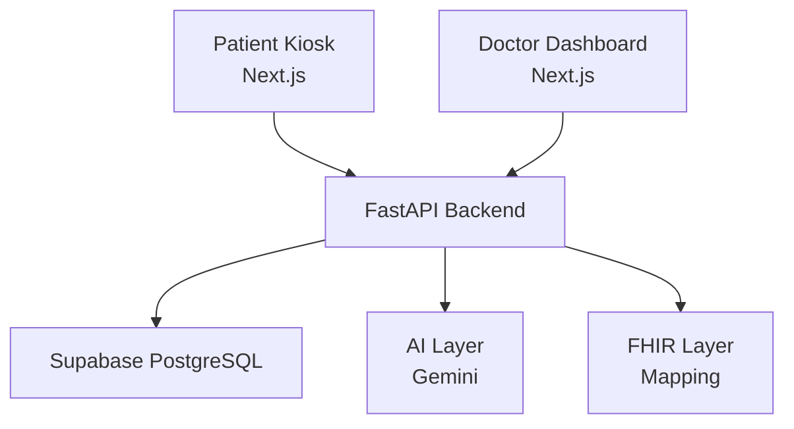

# MediPlatform

AI-powered clinical intake and medical record preparation platform for high-volume Indian hospitals.

## Problem

High-volume OPDs in Indian hospitals are overwhelmed. Doctors spend minimal time with patients and substantial time documenting encounters. Patients wait for hours to provide basic history.

## Solution

MediPlatform addresses this by digitizing the clinical intake and medical history collection *before* the patient reaches the doctor. 
- **Patients** can use smartphone-less kiosks in their native language to answer adaptive clinical questions.
- **Doctors** receive an AI-prepared, structured clinical summary containing Red-Flags, medical history, and OCR-extracted lab/prescription data, allowing them to focus entirely on diagnosis and treatment.
- **Hospitals** gain structured, FHIR-ready medical records.

## Core Features

- Patient kiosk
- Smartphone-less registration
- Multilingual workflow
- Clinical intake
- Voice interaction foundation
- Adaptive questioning
- Red-flag detection
- Medical document digitization
- Gemini OCR
- Medical entity extraction
- AI clinical summary
- Doctor verification
- Timeline
- Supabase PostgreSQL
- FHIR-ready architecture
- Consent/audit architecture

## Architecture

MediPlatform uses a modular, multi-tier architecture to securely process patient data.



## Repository Structure

- `ai/`: Contains AI provider interfaces, mock providers, and real integrations (Gemini) for OCR, NLU, Extraction, and Summarization.
- `backend/`: FastAPI application containing all API endpoints, database models, and core business logic.
- `frontend/`: 
  - `patient-kiosk/`: Next.js frontend for patient interaction.
  - `doctor-dashboard/`: Next.js frontend for doctor review and verification.
- `fhir/`: Foundation for FHIR transformations.
- `docs/`: Extensive project documentation, architecture maps, and implementation reports.

## Tech Stack

**Frontend**: Next.js, TypeScript, Tailwind CSS
**Backend**: FastAPI, Python, SQLAlchemy, Alembic
**Database**: Supabase PostgreSQL
**AI Providers**: Google Gemini (Vision/OCR, Structured Extraction, Clinical Summary)

## Running Locally

**Prerequisites**: Python 3.10+, Node.js 18+

1. **Clone repository**
   ```bash
   git clone https://github.com/your-org/mediplatform.git
   cd mediplatform
   ```

2. **Backend Setup**
   ```bash
   cd backend
   python -m venv .venv
   source .venv/bin/activate  # On Windows: .venv\Scripts\activate
   pip install -r requirements.txt
   ```

3. **Configure Environment**
   Copy `.env.example` to `.env` in `backend/`, `frontend/patient-kiosk/`, and `frontend/doctor-dashboard/`. 
   Fill in your Supabase connection strings and Gemini API keys. (Never commit these secrets!)

4. **Run Migrations**
   ```bash
   alembic upgrade head
   ```

5. **Start Services**
   - **Backend**: `uvicorn app.main:app --reload`
   - **Patient Kiosk**: `cd frontend/patient-kiosk && npm install && npm run dev`
   - **Doctor Dashboard**: `cd frontend/doctor-dashboard && npm install && npm run dev`

## Safety & Disclaimers

- **AI does not autonomously diagnose**: The AI is strictly constrained to structuring and extracting explicitly provided facts.
- **Doctor verification required**: All AI-generated summaries exist in a Draft state and must be manually verified, edited, or rejected by a licensed clinician.
- **Red flags are backend authoritative**: Deterministic safety rules are enforced server-side.
- **No PHI in development**: Do not use real patient data for local development or testing.
- **Secrets**: API keys and database credentials must never be committed to source control.

## Current Status

- **Implemented**: MVP E2E Pipeline, Supabase Integration, Real Gemini AI modules, Patient Kiosk UI, Doctor Dashboard Queue & Review.
- **In progress**: Indic voice integration, FHIR transformations.
- **Future**: ABDM integration, full production security hardening.

*Note: This system is a prototype/MVP and is not yet fully production secure or HIPAA compliant.*
