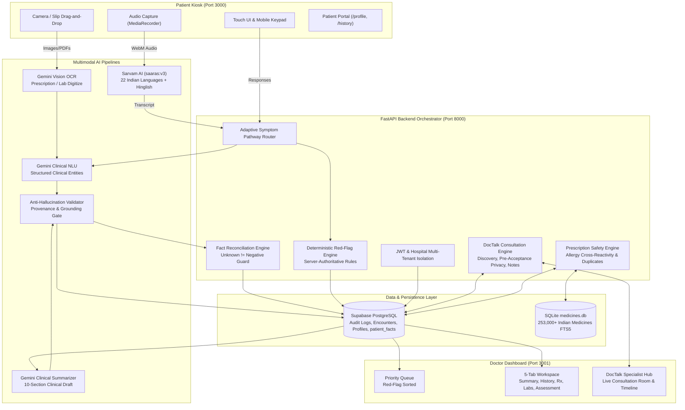
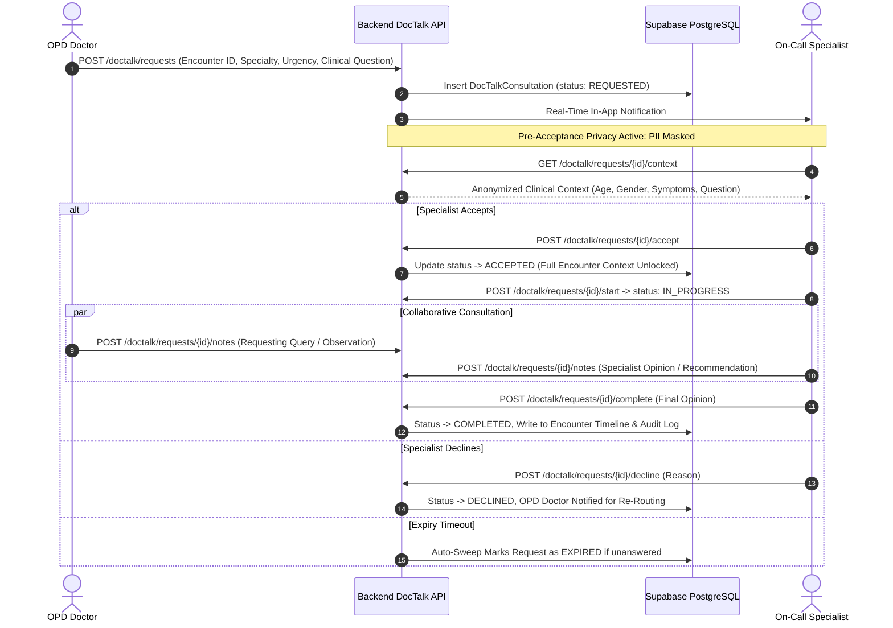
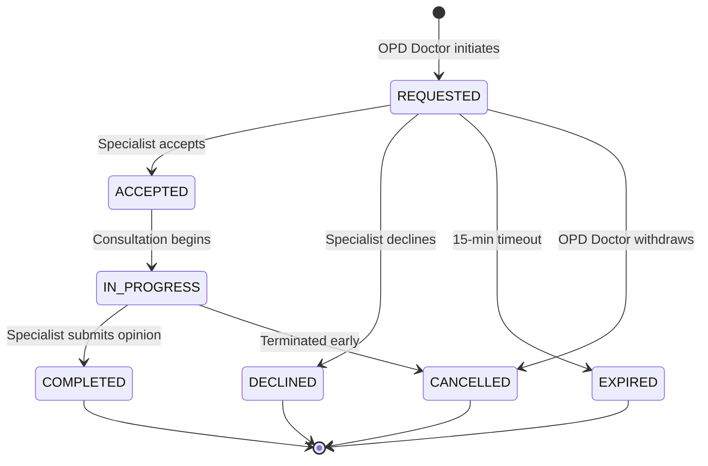
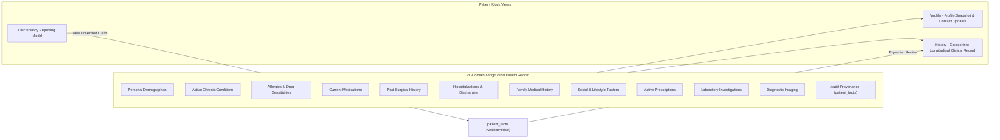
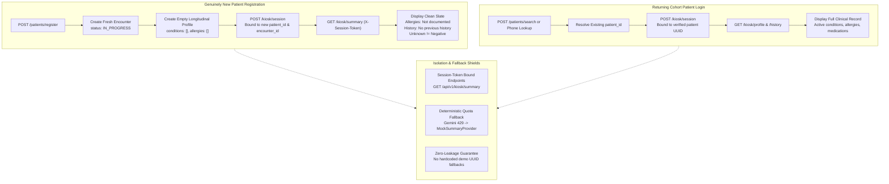
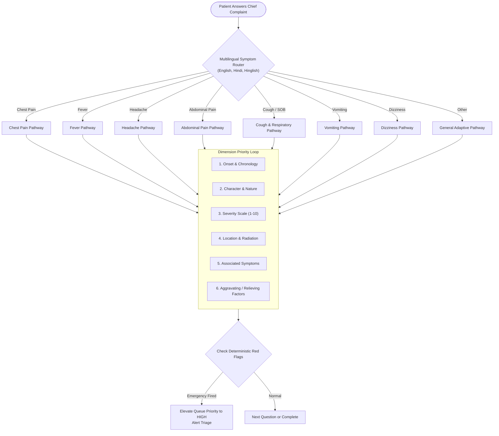
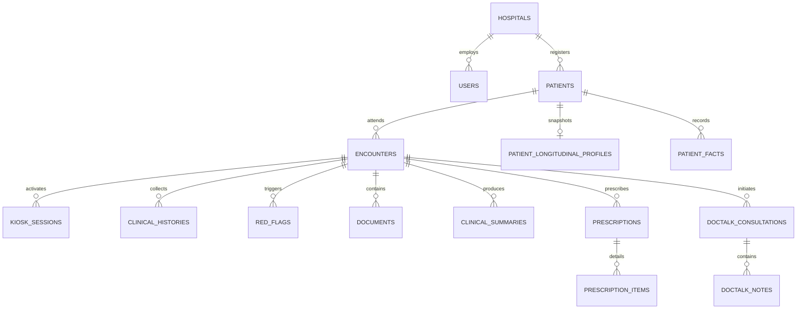

# MediPlatform (MediKiosk)

> **Enterprise AI-Assisted Clinical Intake, Longitudinal Health Record & Specialist Consultation Platform for High-Volume Indian Hospitals**

[](https://www.python.org/downloads/)
[](https://fastapi.tiangolo.com)
[](https://nextjs.org/)
[](https://www.typescriptlang.org/)
[](https://tailwindcss.com/)
[](https://ui.shadcn.com/)
[](https://supabase.com)
[](https://ai.google.dev/)
[](https://www.sarvam.ai/)
[](#10-testing--validation)

---

## 1. Executive Summary & Clinical Vision

Government and high-volume private Outpatient Departments (OPDs) across India routinely manage **80 to 150+ patients per physician shift**, leaving doctors with as little as **2 to 3 minutes per consultation**. Over half of that brief encounter is spent transcribing handwritten paper records, eliciting fundamental symptom chronologies, and translating regional vernacular into medical English.

**MediPlatform** transforms the waiting room into an active, intelligent clinical intake and triage station:

1. **Smartphone-Less Patient Kiosk**: Touch-friendly, high-contrast UI tailored for non-tech-savvy patients.
2. **Indic Voice Recognition**: Powered by Sarvam AI (`saaras:v3`) supporting 22 Indian languages and conversational code-mixed Hinglish.
3. **Multi-Symptom Adaptive Intake Engine**: Dynamic dimension tracking (onset, character, severity, radiation, aggravating/relieving factors) with multi-symptom awareness.
4. **Document Digitization & Medical Extraction**: Gemini Vision OCR transforms physical paper slips and lab reports into structured clinical entities with provenance tracking.
5. **Strict Patient Data Isolation**: Zero-leakage session architecture protecting new patients from cross-contamination, adhering to *Unknown ≠ Negative*.
6. **21-Domain Longitudinal Health Profile**: Immutable audit store (`patient_facts`) paired with high-performance JSONB snapshots for instant historical review.
7. **Deterministic Safety Tripwires**: Server-authoritative Red-Flag Rules and Prescription Drug Safety Engines that execute without probabilistic AI hallucination risks.
8. **DocTalk Specialist Tele-Consultation Network**: Peer-to-peer real-time consultation network connecting general OPD doctors to hospital specialists with pre-acceptance privacy gating.
9. **Physician Verification Workspace**: 5-tab Doctor Dashboard where the doctor reviews, edits, and verifies AI-drafted summaries before sign-off.

> **Foundational Safety Law**: *The doctor is always the ultimate clinical decision-maker. No AI output or hallucinated claim ever enters the legal medical record without explicit physician review and verification.*

---

## 2. High-Level System Architecture



---

## 3. Core Feature Deep-Dives

### 3.1 DocTalk — Hospital Doctor-to-Specialist Live Consultation

DocTalk connects attending OPD physicians with on-call hospital specialists (Cardiologists, Neurologists, Nephrologists, Pulmonologists, etc.) across the hospital or health system.

#### Key Capabilities:
- **Real-Time Specialist Discovery**: Filters by specialty, hospital affiliation, and live availability (`AVAILABLE`, `IN_CONSULTATION`, `OFFLINE`).
- **Deterministic Auto-Match**: `find-any` fallback matches available, eligible specialists based on lowest active caseload.
- **Pre-Acceptance Privacy Guard**: Prior to a specialist accepting a request, patient PII (name, phone, address) is masked. The specialist only reviews clinical urgency, chief complaint, age/gender, and requesting physician notes.
- **Mutual Clinical Notes & Timeline**: Structured recommendations and mutual notes persist directly to the patient's encounter timeline and audit logs.



#### DocTalk State Machine:


---

### 3.2 Patient Longitudinal Profile & Comprehensive History Portal

Patients have access to their complete digital health footprint, ensuring continuity of care across hospital departments.



- **7-Patient Diverse Cohort Demo**: Out-of-the-box pre-configured clinical personas:
  1. *Raj Kumar (42M)*: Type 2 Diabetes, Hypertension, Appendectomy, Penicillin Allergy.
  2. *Anita Desai (38F)*: Rheumatoid Arthritis, Methotrexate, Sulfonamide Allergy.
  3. *Mohan Lal Verma (67M)*: COPD, Ischemic Heart Disease, Aspirin/NSAID Sensitivity.
  4. *Priya Sundaram (29F)*: Hypothyroidism, PCOS, Metformin.
  5. *Dr. Vikram Patel (54M)*: Chronic Kidney Disease (Stage 3b), ACE-Inhibitor Hyperkalemia.
  6. *Sunita Sharma (48F)*: Cholelithiasis, GERD, Ciprofloxacin Allergy.
  7. *Amitabh Roy (61M)*: Post-CABG, Dyslipidemia, Atorvastatin Myopathy.

- **Patient Discrepancy Reporting**: Allows patients to report changes or mistakes in their record. Writes directly to `patient_facts` marked as `verified=false` with provenance tracking for the doctor to review during consultation.

---

### 3.3 Patient Data Isolation & Context Safety

To prevent medical errors, newly registered patients must never inherit or see another patient's medical history.



- **Clean State Guarantees**: A new patient profile starts with empty arrays.
- **Unknown ≠ Negative Principle**: Absences of records are explicitly labeled *"No information recorded"* or *"Not documented"* rather than assuming negative (e.g., absence of allergy record does not equal "No allergies").
- **API Rate-Limit Graceful Fallback**: If Gemini Vision or Summarization hits 429 Quota Exhaustion or network timeouts, the backend automatically transitions to `MockSummaryProvider` to generate a 100% factual summary grounded strictly in the patient's submitted data, preventing 500 errors or fallback data leaks.

---

### 3.4 Multi-Symptom Adaptive Clinical Intake Engine

The intake engine runs an adaptive question loop based on clinical evidence pathways:



---

## 4. Prescription & Medicine Search Engine

- **Authoritative Dataset**: 253,000+ commercial Indian drug formulations (`A_Z_medicines_dataset_of_India.csv`).
- **High-Speed FTS5 Search**: Indexed in SQLite (`medicines.db`) with sub-millisecond prefix search by brand, salt/generic composition, and manufacturer.
- **Safety Tripwires**:
  - **Allergy Cross-Reactivity**: Compares prescribed molecules against recorded allergies in `patient_longitudinal_profiles` (e.g. penicillin → amoxicillin cross-reaction).
  - **Duplicate Medication Alert**: Flags therapeutic duplicates against active medications.
  - **Unknown Allergy Status Warning**: Reminds the physician if allergy status was not explicitly confirmed.
- **Workflow Lifecycle**: `DRAFT` ➔ `SAFETY_CHECKED` ➔ `FINALIZED` (immutable lock) ➔ `AMENDED`.

---

## 5. Technology Stack

| Layer | Technologies | Description |
|---|---|---|
| **Backend Core** | FastAPI, Python 3.13, Uvicorn, AnyIO | Async REST API orchestration and security gating |
| **Database & ORM** | Supabase PostgreSQL, SQLAlchemy, Alembic | Relational models, JSONB profiles, immutable audit facts |
| **Medicines Engine** | SQLite (FTS5 full-text search) | 253,000+ Indian medicines indexed for sub-millisecond search |
| **Voice / ASR** | Sarvam AI (`saaras:v3`) | Indic Speech-to-Text supporting 22 languages and Hinglish |
| **Multimodal OCR** | Google Gemini Vision (`gemini-3.6-flash`), PaddleOCR | High-accuracy extraction from crumpled or handwritten slips |
| **Clinical NLU / LLM** | Google Gemini, OpenAI GPT-4o, Custom Validators | Structured entity extraction with anti-hallucination validation |
| **Patient Kiosk** | Next.js 14, React, Tailwind CSS, Lucide Icons | Touch-first, responsive interface for OPD waiting rooms |
| **Doctor Dashboard** | Next.js 14, React, Tailwind CSS, shadcn/ui | Clinical queue, 5-tab workspace, DocTalk collaboration room |
| **Testing** | Pytest, FastAPI TestClient, Vitest | 295+ comprehensive tests across all backend subsystems |

---

## 6. REST API Reference

### 6.1 DocTalk Specialist Network (`/api/v1/doctalk`)
| Method | Endpoint | Description |
|---|---|---|
| `GET` | `/specialists` | Discover specialists filtered by specialty, hospital, and availability |
| `GET` | `/specialists/find-any` | Deterministic auto-match for earliest available specialist |
| `POST` | `/requests` | Create a new specialist consultation request |
| `GET` | `/requests/my-requests` | List outbound consultation requests for the requesting doctor |
| `GET` | `/requests/my-consultations` | List incoming consultation requests for the specialist |
| `GET` | `/requests/{id}` | Retrieve request details |
| `GET` | `/requests/{id}/context` | Pre-acceptance gated clinical context (PII masked prior to accept) |
| `POST` | `/requests/{id}/accept` | Specialist accepts request and unlocks full encounter |
| `POST` | `/requests/{id}/decline` | Specialist declines request with reason |
| `POST` | `/requests/{id}/start` | Transition status to `IN_PROGRESS` |
| `POST` | `/requests/{id}/complete` | Submit final specialist opinion and complete consultation |
| `GET/POST`| `/requests/{id}/notes` | Live consultation mutual notes and structured discussion |

### 6.2 Patient Kiosk & Profiles (`/api/v1/kiosk`)
| Method | Endpoint | Description |
|---|---|---|
| `POST` | `/session` | Create or resume a kiosk session token |
| `GET` | `/profile` | Comprehensive patient profile with longitudinal data |
| `PATCH` | `/profile/demographics` | Safe patient self-service contact and demographic update |
| `POST` | `/profile/report-change` | Log discrepancy / unverified medical history change for doctor review |
| `GET` | `/summary` | Session-authenticated AI clinical summary (strictly isolated) |
| `POST` | `/summary/generate` | Trigger on-demand AI summary draft for authenticated kiosk session |

### 6.3 Clinical Intake & Voice (`/api/v1`)
| Method | Endpoint | Description |
|---|---|---|
| `POST` | `/clinical/start` | Initialize clinical intake conversation for session |
| `GET` | `/clinical/state` | Current conversation state, active pathway, collected facts |
| `POST` | `/clinical/answer` | Submit answer (voice transcript or text), extract facts, evaluate red flags |
| `POST` | `/voice/transcribe` | Sarvam AI ASR multipart audio transcription |
| `POST` | `/documents/upload` | Upload physical slip/lab report for OCR and entity extraction |

### 6.4 Prescriptions & Encounters (`/api/v1`)
| Method | Endpoint | Description |
|---|---|---|
| `GET` | `/medicines/search` | Fast autocomplete across 253k Indian medicines |
| `GET` | `/medicines/{id}` | Detailed medicine composition, salt, and manufacturer |
| `POST` | `/encounters/{id}/prescriptions`| Create or update draft prescription |
| `POST` | `/prescriptions/{id}/safety-check` | Execute deterministic allergy and duplicate checks |
| `POST` | `/prescriptions/{id}/finalize` | Sign-off and finalize prescription; sync to longitudinal record |
| `GET` | `/encounters/active` | Hospital-scoped active queue sorted by red-flag severity |

---

## 7. Database Schema & Models



---

## 8. Directory Structure

```text
MediKiosk/
├── A_Z_medicines_dataset_of_India.csv       # 253k Indian medicines dataset
├── README.md                                # This document
├── AGENTS.md                                # Architecture knowledge base & agent rules
├── ai/                                      # Multimodal AI & Deterministic Engines
│   ├── asr/                                 # Sarvam ASR provider + Mock
│   ├── clinical_nlu/                        # Clinical NLU extraction providers
│   ├── medical_extraction/                  # OCR entity extraction models & logic
│   ├── ocr/                                 # Gemini Vision & PaddleOCR providers
│   ├── question_engine/                     # Adaptive clinical symptom pathways
│   ├── reconciliation/                      # Deterministic Fact Reconciliation
│   ├── red_flags/                           # Deterministic Red-Flag Rule Engine
│   └── summarization/                       # Clinical summary providers & validator
├── backend/                                 # FastAPI Application
│   ├── alembic/                             # Database migrations
│   ├── app/
│   │   ├── api/endpoints/                   # clinical, doctalk, encounters, kiosk, etc.
│   │   ├── models/models.py                 # SQLAlchemy database schema
│   │   ├── schemas/                         # Pydantic request & response models
│   │   └── services/                        # Medicine search, DocTalk session manager, etc.
│   └── tests/                               # 295 automated Pytest suites
└── frontend/
    ├── patient-kiosk/                       # Next.js 14 touch-first kiosk application (Port 3000)
    │   └── src/app/
    │       ├── clinical/                    # Conversational intake with voice
    │       ├── history/                     # Comprehensive medical history portal
    │       ├── profile/                     # Patient profile & discrepancy reporting
    │       └── summary-preview/             # Isolated AI summary preview
    └── doctor-dashboard/                    # Next.js 14 physician dashboard (Port 3001)
        └── src/app/
            ├── queue/                       # Priority triage queue
            ├── encounters/[id]/             # 5-tab physician workspace
            └── doctalk/                     # DocTalk specialist tele-consultation hub
```

---

## 9. Quickstart & Local Setup

### 9.1 Prerequisites
- **Python 3.13+**
- **Node.js 18+ & npm**
- **Supabase PostgreSQL** account or local PostgreSQL instance

### 9.2 Backend Setup
```bash
cd backend
python -m venv .venv
source .venv/bin/activate  # On Windows: .venv\Scripts\activate
pip install -r requirements.txt

# Configure environment
cp .env.example .env
# Edit .env with your DATABASE_URL, GEMINI_API_KEY, and SARVAM_API_KEY

# Run database migrations & seed reference data
alembic upgrade head
python seed_doctors.py
python seed_patients.py

# Start FastAPI server
uvicorn app.main:app --host 0.0.0.0 --port 8000 --reload
```

### 9.3 Patient Kiosk Setup (Port 3000)
```bash
cd frontend/patient-kiosk
npm install
npm run dev
# Kiosk accessible at http://localhost:3000
```

### 9.4 Doctor Dashboard Setup (Port 3001)
```bash
cd frontend/doctor-dashboard
npm install
npx next dev --port 3001
# Dashboard accessible at http://localhost:3001
```

---

## 10. Testing & Validation

The codebase includes **295 automated tests** covering all clinical safety paths, cross-hospital isolation boundaries, DocTalk workflows, and patient data protection rules.

```bash
cd backend

# Run the complete test suite
pytest -v

# Run specific isolation and safety suites
pytest tests/test_patient_data_isolation.py -v
pytest tests/test_patient_profile.py -v
pytest tests/test_doctalk.py tests/test_doctalk_security.py -v
pytest tests/test_prescriptions.py -v
pytest tests/test_red_flags.py -v
```

### Frontend Static Type Checking:
```bash
cd frontend/patient-kiosk && npx tsc --noEmit
cd frontend/doctor-dashboard && npx tsc --noEmit
```

---

## 11. Safety, Governance & Clinical Ethics

1. **Human-in-the-Loop Imperative**: AI generates preliminary documentation drafts only; a licensed physician must review, edit, and sign off on every clinical summary and prescription.
2. **Deterministic Safety Primacy**: Red-flag emergency detection and drug-drug/allergy safety checks are 100% deterministic rules. AI is never permitted to override or suppress triage severity.
3. **Unknown ≠ Negative**: Absence of clinical data is never treated as a negative finding. The system explicitly reminds physicians when allergies or past histories are unrecorded.
4. **Verifiable Provenance**: Every extracted clinical claim maintains a reference to source text, timestamp, and confidence score. The Anti-Hallucination Validator automatically strips unsupported statements.
5. **Hospital-Level Tenant Isolation**: All endpoints enforce strict hospital boundary access checks. Cross-tenant queries fail with HTTP 404 to eliminate information leakage.

---

## 12. Authors & License

Maintained by the **MediPlatform Engineering Team**.  
Licensed under the [MIT License](LICENSE).
